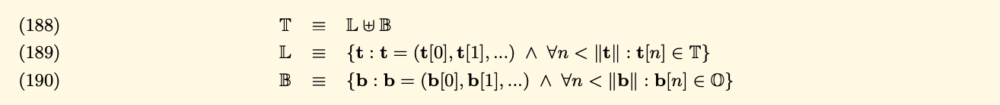
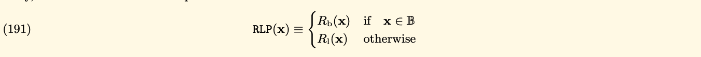

> The main purpose of this repository is understanding about how Ethereum
> serialize data(encoding/decoding).

#### Reference
- [Go-ethereum written by Go](https://github.com/ethereum/go-ethereum)
- [Go-ethereum analysis](https://github.com/agiletechvn/go-ethereum-code-analysis/blob/master/go-ethereum-code-analysis.md)
- [Yellow Paper](https://ethereum.github.io/yellowpaper/paper.pdf)
- [Documentation](https://ethereum.org/vi/developers/docs/data-structures-and-encoding/rlp)
- [Medium](https://medium.com/coinmonks/data-structure-in-ethereum-episode-1-recursive-length-prefix-rlp-encoding-decoding-d1016832f919)
- [Go-ethereum monorepo written by JS](https://github.com/ethereumjs/ethereumjs-monorepo)

> I will explain more detail with this package to help you and me understand clearly about
> source code.

#### Recursive Length Prefix
In short as RLP, RLP is the package Ethereum used to serialize all objects to the array of bytes.
It is described in Yellow Paper with many formulas, and very difficult to understand its.

Because Ethereum is a decentralized blockchain, that enables the execution of smart contracts and 
the storage of data on the blockchain, its need to be serialized or converted into a binary format,
stored in a minimal amount of space in the blockchain.

RLP is a prefix based encoding schema that encodes arbitrarily structured binary data(byte arrays) in a way that be easy to encode and decode its. 
RLP algorithm works by recursively encoding a list of items.

An item is defined as follows:
- A string(byte array)
- A list of "item" itself

For example:
- A string(byte array), includes an empty string
- A list containing any numbers of string
- A complex data structure like `["cat", ["dog", "mouse"], [], ["""]]`

#### Walk through into Yellow Paper(Appendix B)
We have three formulas that describes about **arbitrarily structured binary data(byte arrays)**:


- T: Arbitrarily structured binary data, is a set of byte arrays and structural sequences
- L: Set of all tree-like structures that are not a single leaf
- O: Set of 8-bit bytes
- B: Set of all sequences of bytes(bytes array or a leaf in tree)
- We use **disjoint union** to distinguish the empty byte array(in B) vs empty list(in L).

We define RLP function as RLP through two sub-functions:
- The first handling the byte arrays
- The second handle the sequences of further values


We will deep dive into the first function that handles the byte array, **RLP(B)**. If the value to be serialized is a 
byte array, the RLP(B) will take one of three forms:
- A single byte less than 128(decimal), the output is same the input
- If the array bytes contain fewer than 56 bytes, then the output is equal to the input prefixed by the byte
equal to the length of the array byte + 128
- Otherwise, the output is equal to the big endian representation of the input length in front of the input, and then preceded by (183 + the length of the big end of the input)
.png)


Second, we will see how the RLP(L) works. We use RLP(L) to encode each item, then concatenate the output.
- If the length is smaller than 56, the output is equal: 192 + length of item + item
- Otherwise, the output is equal: 247 + length of the big-endian of the length of item + the big-endian of the length of item + item
.png)

You can see **s(x)** is recursive of RLP with each item.

RLP algorithm as code like(example from ethereum.org):
```python
def rlp_encode(input):
    if isinstance(input,str):
        // 0x80 = 128(decimal)
        if len(input) == 1 and ord(input) < 0x80: return input
        else: return encode_length(len(input), 0x80) + input
    elif isinstance(input,list):
        output = ''
        for item in input: output += rlp_encode(item)
        return encode_length(len(output), 0xc0) + output

def encode_length(L,offset):
    if L < 56:
         return chr(L + offset)
    elif L < 256**8:
         BL = to_binary(L)
         return chr(len(BL) + offset + 55) + BL
    else:
         raise Exception("input too long")

def to_binary(x):
    if x == 0:
        return ''
    else:
        return to_binary(int(x / 256)) + chr(x % 256)
```

You can see the example in the Ethereum documentation with some inputs:
- A String "ethereum" => ["0x88", "e", "t", "h", "e", "r", "e", "u", "m"] => because the length of this 
string is 8 characters, is smaller than 56. So the output is encode_length(8, 128) + input = **chr(136)** + "ethereum" = ["0x88", "e", "t", "h", "e", "r", "e", "u", "m"]
- A list ["ethereum", "foundation"]:
  - Same the example above, we got the output of `rlp_encode("ethereum") = ["0x88", "e", "t", "h", "e", "r", "e", "u", "m"]`
  - And `rlp_encode("foundation") = ["0x8A", "f", "o", "u", "n", "d", "a", "t", "i", "o", "n"]`
  - So, the output is `rlp_encode(["ethereum", "foundation"]) = encode_length(20, 192) + ["0x88", "e", "t", "h", "e", "r", "e", "u", "m", "0x8A", "f", "o", "u", "n", "d", "a", "t", "i", "o", "n"] = ["0xD4", "0x88", "e", "t", "h", "e", "r", "e", "u", "m", "0x8A", "f", "o", "u", "n", "d", "a", "t", "i", "o", "n"] `

### RLP decoding
Because of the rules of RLP encoding, so the input of RLP decoding is an array of binary data.
- Depend on the first byte in the input, we can determine the data type and the length of the data and offset.
- Depend on the data type and offset of data, decode the data correspondingly.
- Continue loop to decode the remain of input.

With the RLP formulas, we can determine to rules of decoding the data type and offset by the following:
- If the range of the first byte is from [0x00, 0x7f], and the length of the input is 1, so the data type is string and the data is the string itself.
- If the range of the first byte is from [0x80, 0xb7], the data type is string, and the length of the string is equal to the first byte minus 0x80
- If the range of the first byte is [0xb8, 0xbf], and the length of the string whose length in bytes is equal to the first byte minus 0xb7 follows the first byte, and the string follows the length of the string;
- If the range of the first byte is [0xc0, 0xf7], and the concatenation of the RLP encodings of all items of the list which the total payload is equal to the first byte minus 0xc0 follows the first byte; 
- If the range of the first byte is [0xf8, 0xff], and the total payload of the list whose length is equal to the first byte minus 0xf7 follows the first byte, and the concatenation of the RLP encodings of all items of the list follows the total payload of the list;
<br/>

**Source: Ethereum Docs**

**The pseudo code from Ethereum Docs:**
```python
def rlp_decode(input):
    if len(input) == 0:
        return
    output = ''
    (offset, dataLen, type) = decode_length(input)
    if type is str:
        output = instantiate_str(substr(input, offset, dataLen))
    elif type is list:
        output = instantiate_list(substr(input, offset, dataLen))
    output + rlp_decode(substr(input, offset + dataLen))
    return output

def decode_length(input):
    length = len(input)
    if length == 0:
        raise Exception("input is null")
    prefix = ord(input[0])
    if prefix <= 0x7f:
        return (0, 1, str)
    elif prefix <= 0xb7 and length > prefix - 0x80:
        strLen = prefix - 0x80
        return (1, strLen, str)
    elif prefix <= 0xbf and length > prefix - 0xb7 and length > prefix - 0xb7 + to_integer(substr(input, 1, prefix - 0xb7)):
        lenOfStrLen = prefix - 0xb7
        strLen = to_integer(substr(input, 1, lenOfStrLen))
        return (1 + lenOfStrLen, strLen, str)
    elif prefix <= 0xf7 and length > prefix - 0xc0:
        listLen = prefix - 0xc0;
        return (1, listLen, list)
    elif prefix <= 0xff and length > prefix - 0xf7 and length > prefix - 0xf7 + to_integer(substr(input, 1, prefix - 0xf7)):
        lenOfListLen = prefix - 0xf7
        listLen = to_integer(substr(input, 1, lenOfListLen))
        return (1 + lenOfListLen, listLen, list)
    else:
        raise Exception("input does not conform to RLP encoding form")

def to_integer(b):
    length = len(b)
    if length == 0:
        raise Exception("input is null")
    elif length == 1:
        return ord(b[0])
    else:
        return ord(substr(b, -1)) + to_integer(substr(b, 0, -1)) * 256
```


> Very difficult to fully understand with these formulas, so we need to debug to know what the output
> when we use RLP to encode/decode the arbitrarily structured binary data.